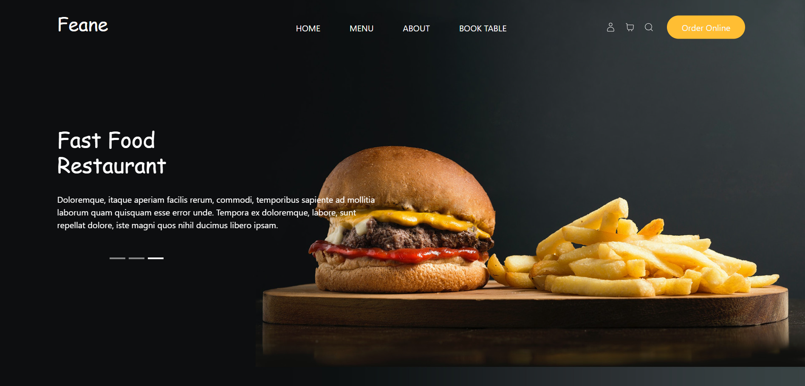
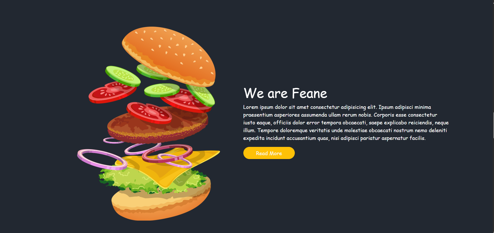
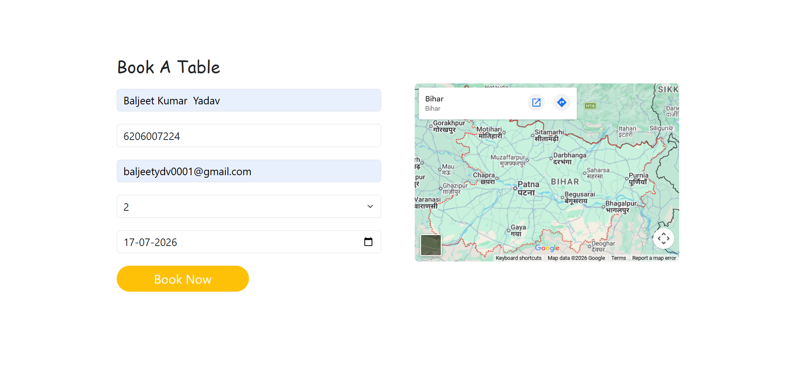
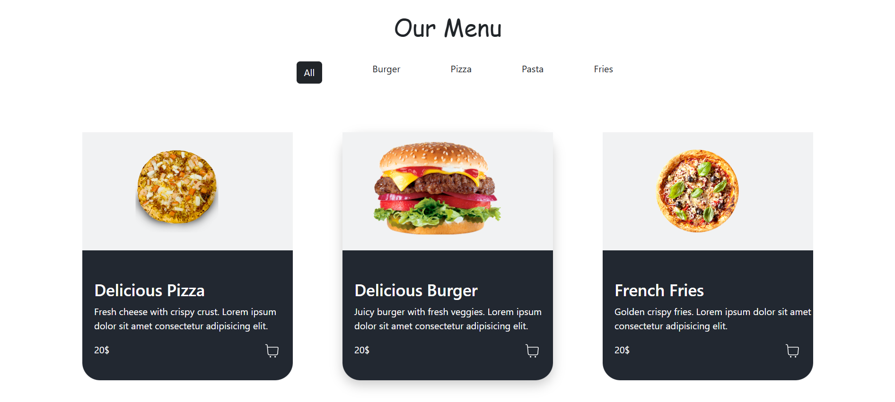
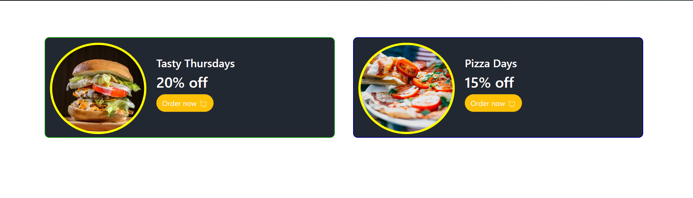

# FEANE Restaurant Website

A modern, responsive restaurant website built with React and Vite. This project showcases a polished dining experience through a clean landing page, featured food sections, special offers, about information, and a table reservation experience.

## Overview

FEANE is a visually appealing restaurant website designed to present the brand, menu highlights, and booking flow in a professional and user-friendly way. The interface is built with reusable React components and a responsive layout to support both desktop and mobile users.

## Features

- Responsive hero section with strong visual branding
- Featured food and offers sections
- About section to communicate restaurant story and value
- Reservation / table booking section
- Smooth navigation with React Router
- Modern styling with Bootstrap and custom CSS

## Tech Stack

- React 19
- Vite 8
- React Router DOM
- Bootstrap 5
- React Hook Form
- Yup
- React Icons
- ESLint

## Project Structure

```text
src/
  components/      # Reusable UI sections such as Navbar, Hero, Menu, Offer, Footer
  pages/           # Main route-based pages
  assets/          # Static images and media files
  App.jsx          # Main app component and routing setup
  main.jsx         # Application entry point
```

## Assets Overview

The project uses the following image assets from the assets folder for different sections:

```text
src/assets/
  about-img.png              # About section visual
  About-Section.png          # About section illustration
  BookTable.png              # Booking section image
  Menu-Section.png           # Menu section image
  Menue-Section.png          # Alternate menu section image
  Offer-Section.png          # Offer section image
  Navbar-Hero-Section.png    # Hero/navigation visual
  hero-bg.jpg                # Hero background image
  hero.png                   # Main hero image
  o1.jpg, o2.jpg             # Offer images
  f1.png to f9.png           # Food item images
```

### Project Screenshots











These assets are organized to support the restaurant landing page sections such as About, Book Table, Menu, and Offers.

## Prerequisites

Make sure you have the following installed:

- Node.js 18 or newer
- npm or pnpm

## Installation

1. Clone the repository:

   ```bash
   git clone <repository-url>
   cd FEANE_RESTAURANT_WEBSITE
   ```

2. Install dependencies:

   ```bash
   npm install
   ```

3. Start the development server:

   ```bash
   npm run dev
   ```

4. Open the local URL shown in the terminal to view the project.

## Available Scripts

- `npm run dev` — starts the Vite development server
- `npm run build` — creates a production build
- `npm run preview` — previews the production build locally
- `npm run lint` — runs ESLint for code quality checks

## Development Notes

This project follows a component-based structure for scalability and maintainability. New sections or reusable UI elements should be added under the components directory, while page-level layouts belong in the pages directory.

## Contributing

Contributions are welcome. If you would like to improve the project, please create a feature branch, make your changes, and open a pull request with a clear description.
